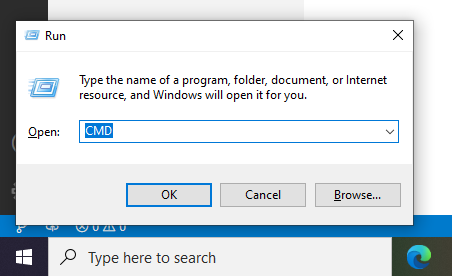
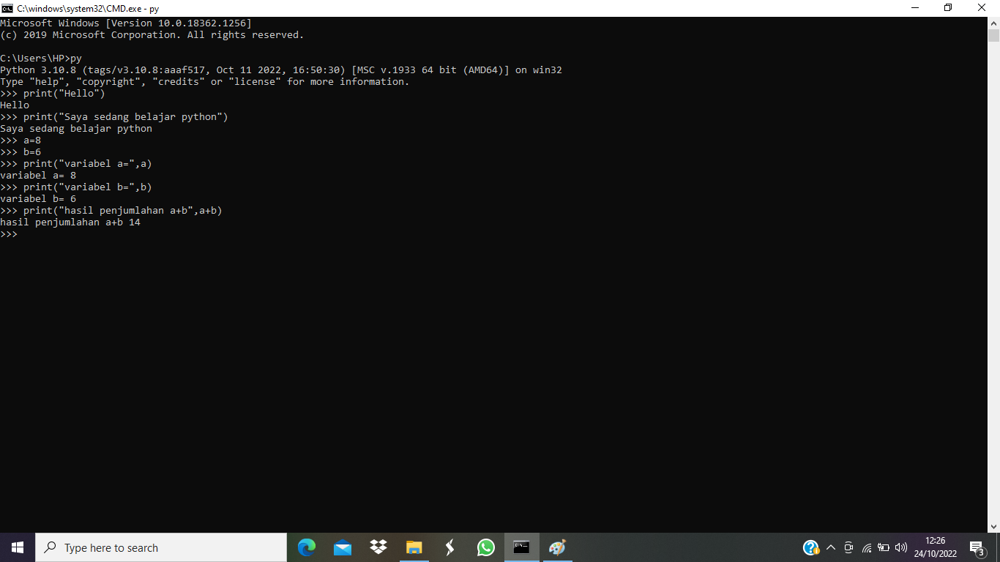

# Lab2py

# Menjalankan Python Console

1. Pastikan python sudah terinstal pada laptop

2. Buka CMD dengan cara klik windows + r lalu klik 'oke'

3. Menampilkan Latihan1 Python, "Hello" dan "Saya sedang belajar python"

4. Menampilkan Latihan2 Python, menjumlahkan dua buah bilangan menggunakan variabel a dan b

# Menjalankan IDLE

1. IDLE ini adalah teks editor bawaan python yang sudah otomatis terinstal

2. Menjalankan IDLE

- Membuat fungsi input untuk mengambil nilai variabel
- Mencetak hasil inputan
- Mencetak hasil inputan variabel dengan format String
- Konversi nilai variabel

- Hasil dari program

# Mengcommit file yang sudah dikerjakan ke github

1. Langkahnya adalah sebagai berikut

